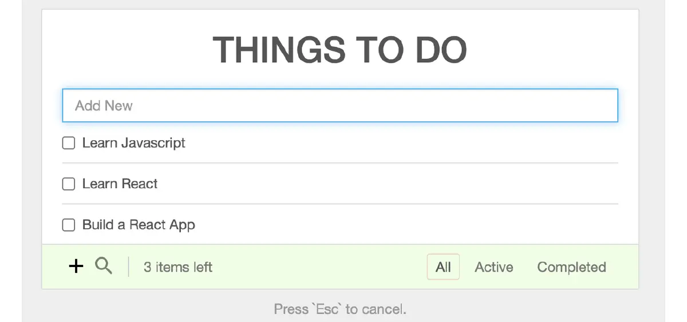
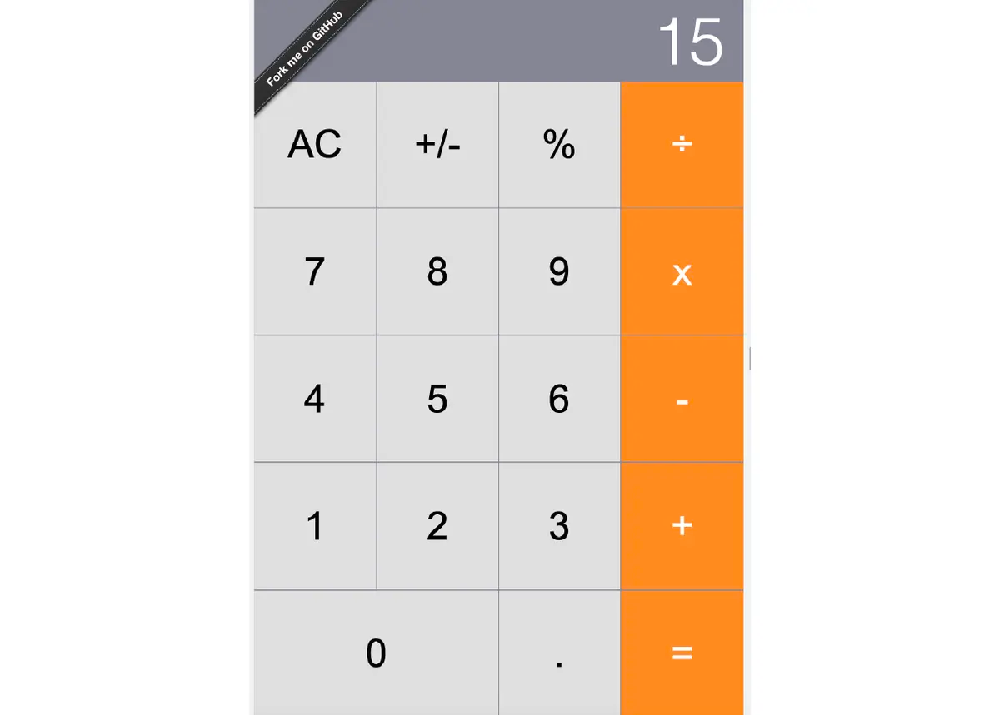
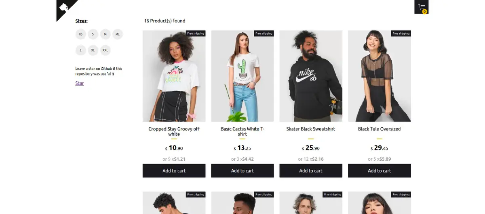
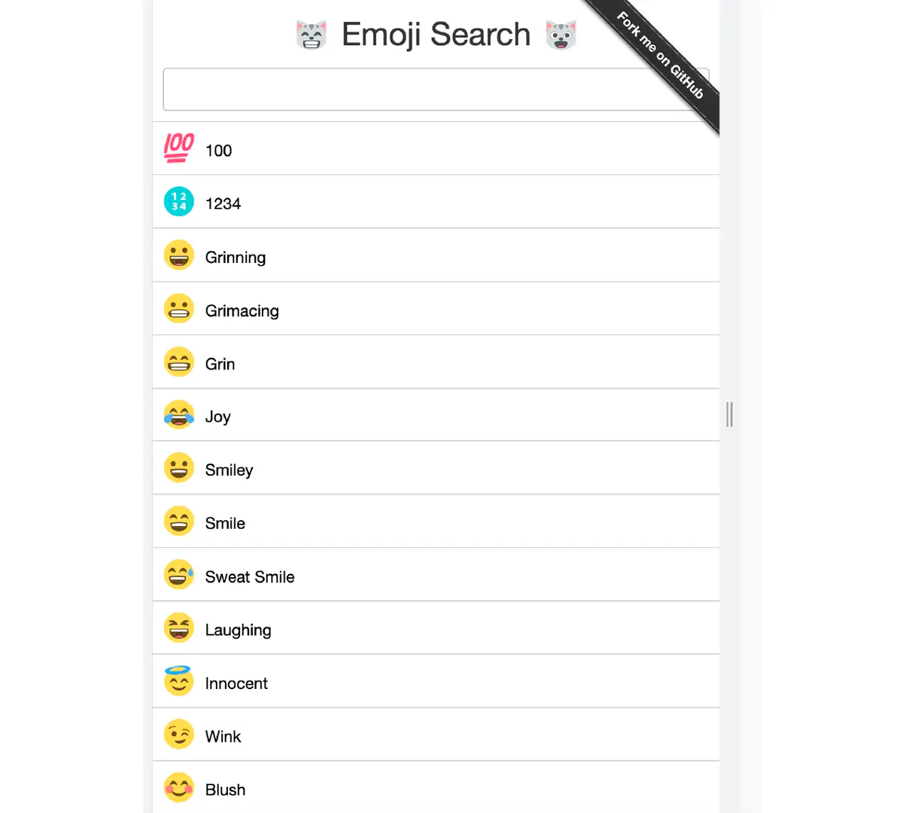
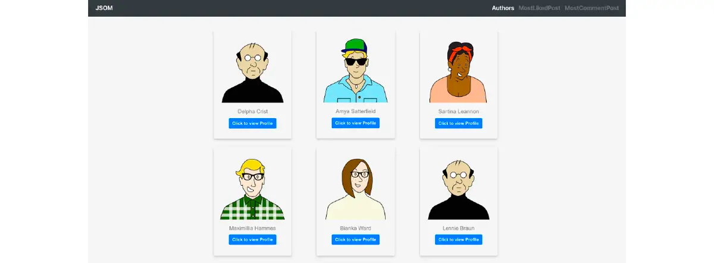

# To Do App #
A app that keeps track of your to-do actions, you can add any number of tasks to it, 
search those tasks, click on the checkbox to complete the task, and filter using buttons 
like active tasks, completed tasks and all the tasks.
[link](https://github.com/kabirbaidhya/react-todo-app)

# Calculator #
[link](https://ahfarmer.github.io/calculator)

# Snapshot #
It’s a simple gallery project where we can search the photos by keywords,
change the category based on given options as Mountain, Beaches, Birds, Food.
Once you hover on the images, you will get the zoom-in images.
[link](https://github.com/Yog9/SnapShot)

# E Commerce h3 #
[link](https://react-shopping-cart-67954.firebaseapp.com)

# Emoji Search #
[link](https://ahfarmer.github.io/emoji-search/)

# Blog App #
[link](https://react-blog-website.vercel.app/)

# Weather App #
A weather application that provides detailed weather details for a location specified by the user. 
Built using React and Open Weather API for showing latest weather data. 
Here we have search options with city and country for which we would like to see weather forecast.
We will use the fetch method to fetch the API calls along with the React hooks and conditional rendering.
[link](https://github.com/codebucks27/React-Weather-app)
